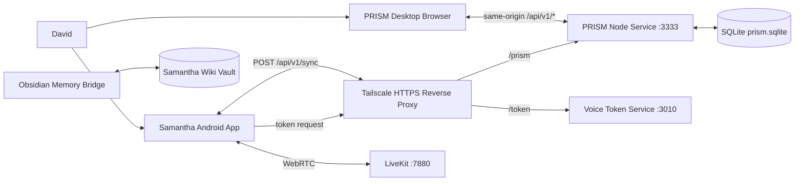
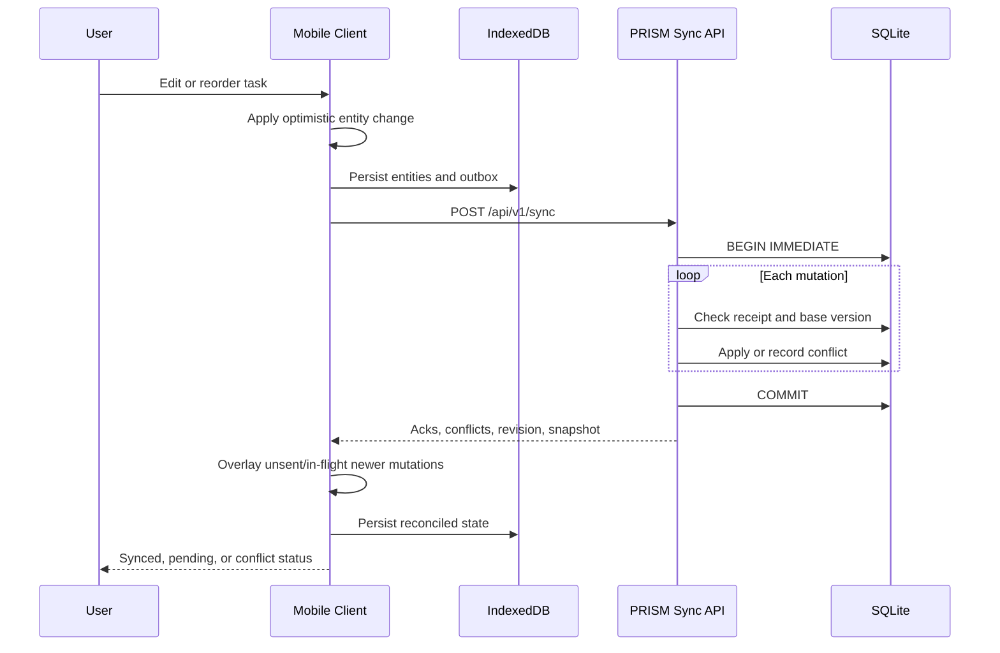
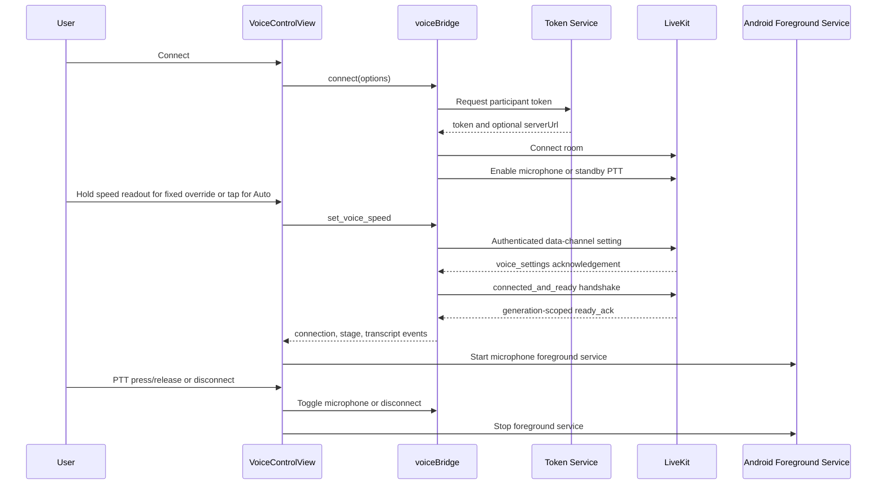

# Samantha App Architecture

| Metadata | Value |
|---|---|
| Document status | Canonical current-state architecture |
| System version | Samantha App 2.4.0, Voice Bridge Client 2.6.0, PRISM Sync Schema 1 |
| Last verified | 2026-07-13 |
| Project root | Active `SAMANTHA_APP` repository root, resolved at runtime |
| Companion service root | Active PRISM repository root, resolved separately at runtime |

Path notation in this document uses `APP_ROOT` for the active Samantha App repository, `PRISM_ROOT` for the companion PRISM repository, and `$HOME/Samantha/wiki` for the default local vault. Commands for Samantha App assume the current directory is `APP_ROOT` unless stated otherwise.

## 1. Purpose

This document describes the complete implemented architecture of the Samantha mobile app and the PRISM desktop system it synchronizes with. It defines the product boundaries, runtime topology, data model, offline and synchronization contracts, voice subsystem, Android integration, memory bridge, deployment model, failure policy, verification evidence, and known risks.

The primary architectural objective is simple:

> Samantha mobile and PRISM desktop must present the same durable project state, remain useful while disconnected, and converge automatically without replacing one client's entire state with another client's copy.

This reference supersedes the earlier full-state and seed-based synchronization design. Historical incident analysis remains in `docs/data-flow-audit.md`; the focused sync implementation reference remains in `docs/sync-architecture.md`.

## 2. Product Scope

Samantha is an Android-first personal operating interface with four primary surfaces:

1. **Voice** - connects to Samantha through a LiveKit voice bridge.
2. **Projects** - browses projects and their tasks, creates tasks, edits task details, and promotes tasks into Next.
3. **Next** - shows the single prioritized cross-project execution queue and supports drag reordering.
4. **Timer** - runs a multi-phase focus sequence in the context of a selected task.

PRISM is the desktop project-management surface and the authoritative synchronization service. It serves its browser UI, persists shared entities in SQLite, accepts versioned mutations from both clients, and returns reconciliation snapshots.

The Obsidian memory bridge is an adjacent Samantha capability. It writes structured memory notes into the existing vault. It is included here because it is operated from this project, but it is not part of the project/task synchronization transaction boundary.

## 3. Architectural Principles

The implementation follows these standing rules:

- **Local first:** a user action updates the local UI immediately and is durable locally before network success is required.
- **Entity mutations, not full-state replacement:** clients send bounded project/task changes with stable mutation IDs.
- **One authority:** SQLite in PRISM is the canonical shared state after reconciliation.
- **Explicit ordering:** project, task, and Next ordering are stored as rank fields, never inferred from array position alone.
- **One Next rule:** a task belongs to Next if and only if `nextRank` is a non-empty string.
- **Idempotent retry:** a retried mutation cannot be applied twice.
- **Versioned writes:** every mutation states the entity version it was based on.
- **Visible health:** users can see sync state and manually request a retry.
- **Schema validation:** the mobile client validates server responses before applying them.
- **Isolated subsystems:** entity sync, navigation, voice, Android lifecycle support, and memory tooling have separate modules and failure domains.
- **Immutable migration input:** `.prism_seed.json` is an import source, not a runtime database.

## 4. System Context



### 4.1 Runtime ownership

| Component | Responsibility | Durable state |
|---|---|---|
| Samantha React app | Mobile presentation, optimistic edits, local outbox, voice controls, timer | IndexedDB plus localStorage mirror |
| Capacitor Android shell | Native packaging, microphone permissions, foreground service, WebView host | Android app storage and preferences |
| PRISM browser client | Desktop presentation, optimistic edits, local outbox | Browser localStorage |
| PRISM Node service | Static UI, sync API, migration, brief endpoint | SQLite and brief files |
| SQLite store | Canonical projects/tasks, versions, revisions, mutation receipts, conflicts | `PRISM_ROOT/state/prism.sqlite` |
| Seed | One-time legacy import | `PRISM_ROOT/.prism_seed.json` |
| Voice token service | Issues LiveKit connection credentials | Outside this repository |
| LiveKit | Real-time audio and data channel transport | Outside this repository |
| Obsidian bridge | Structured memory-note creation and optional sync invocation | `$HOME/Samantha/wiki` by current convention |

## 5. Runtime Topology and Configuration

### 5.1 Development

| Service | Default address | Notes |
|---|---|---|
| Samantha Vite app | `http://localhost:5173` | Started with `npm run dev` |
| PRISM UI and API | `http://localhost:3333` | Started from `PRISM_ROOT` with `npm start` |
| Voice token endpoint | `http://localhost:3010/api/voice/token` | Configured by `.env` |
| LiveKit | `ws://localhost:7880` | Local WebSocket endpoint |

The app reads `VITE_API_BASE` and appends `/api/v1/sync`. The example configuration therefore uses `http://localhost:3333`, not an endpoint ending in `/state`, `/seed`, or `/sync`.

### 5.2 Production mobile profile

The checked-in production profile is:

```dotenv
VITE_API_BASE=https://xenya.tail6504c1.ts.net/prism
VITE_VOICE_TOKEN_ENDPOINT=https://xenya.tail6504c1.ts.net/token/api/voice/token
VITE_LIVEKIT_URL=wss://xenya.tail6504c1.ts.net/livekit
```

The Tailscale HTTPS edge routes `/prism` to PRISM on port 3333 and `/token` to the token service. The mobile app uses TLS-facing URLs even though the Android package currently permits cleartext and mixed content for local/Tailscale compatibility.

### 5.3 Build-time configuration rule

Vite environment values are compiled into the web bundle. Changing `.env.production` does not alter an already installed APK. A configuration change requires a production build, Capacitor sync, APK build, and handset installation.

Production routing is a fail-closed release contract:

- `.env.production` is versioned because its `VITE_*` URLs are public client configuration, not secrets. Local `.env` variants remain ignored.
- `npm run build` explicitly selects Vite production mode and runs `verify:mobile-routing` against `dist`.
- `npm run cap:sync` rebuilds production assets, copies them to Android, and runs `verify:android-routing` against the copied bundle.
- Android `preBuild` runs `verifyMobileRouting`; Gradle refuses to package assets that omit `https://xenya.tail6504c1.ts.net/prism` or contain a private Tailnet IPv4 URL.
- The routing verifier also requires the production Voice token and LiveKit URLs plus canonical `/api/v1/sync`.

This gate prevents Android Studio or a direct Gradle debug build from silently packaging stale development web assets. It proves artifact configuration; it does not prove that the Tailscale HTTPS edge is currently serving the configured route.

## 6. Technology Stack

### 6.1 Mobile/web client

- React 19 and React DOM 19
- TypeScript 6
- Vite 8
- Zustand 5 with persistence middleware
- Zod 4 for network-contract validation
- Capacitor 8 with Android and Network plugins
- LiveKit Client 2 for voice transport
- DnD Kit for task and Next ordering
- Lucide React for icons
- Tailwind CSS 4 through the Vite plugin
- Playwright for browser-level contracts

### 6.2 PRISM service

- Node.js built-in HTTP server
- Node built-in `node:sqlite` API
- Browser JavaScript desktop client
- Service worker for static shell availability
- Node test runner for store-level contract tests

PRISM requires Node.js 22.5 or newer because `node:sqlite` is part of the persistence implementation.

### 6.3 Native Android shell

- Capacitor BridgeActivity
- Capawesome Android foreground-service plugin
- Gradle Android application module
- Application ID and namespace: `com.samantha.voice`

## 7. Mobile Application Structure

```text
src/
  App.tsx                         Application shell and global indicators
  main.tsx                        React entry point
  components/BottomNav.tsx       Four-surface navigation
  views/
    VoiceControlView.tsx          Voice connection and transcript controls
    ProjectsView.tsx              Project/task browsing and task creation
    BacklogView.tsx               Canonical Next queue
    SprintTimerView.tsx           Focus cycle
    EpicDetailView.tsx            Task detail/edit overlay
  stores/
    entityStore.ts                Projects, tasks, outbox, sync status
    navigationStore.ts            Active surface and selected/active task
    voiceStore.ts                 Voice connection and pipeline status
  services/
    syncManager.ts                Sync orchestration
    voiceBridge.ts                LiveKit adapter
    foregroundService.ts          Android voice foreground service
  sync/
    contract.ts                   Schema and domain mapping
    indexedDbStorage.ts           Durable local persistence adapter
```

### 7.1 Application shell

`src/App.tsx` initializes `SyncManager` once and keeps four full-screen views mounted so a live Voice connection survives navigation. Only the bottom icon controls change the active view; the viewport is not horizontally scrollable. The default view is Voice. Sortable lists apply a shared vertical-axis modifier so dragging cannot escape into an adjacent view.

Global overlays are intentionally outside individual views:

- sync status and manual retry control;
- connected voice-session indicator when the Voice view is not visible;
- task detail dialog;
- bottom navigation.

This means a voice session and synchronization remain active while the user moves between product surfaces.

### 7.2 State boundaries

| Store | State | Persistence |
|---|---|---|
| `entityStore` | projects, tasks/epics, outbox, server revision, last sync time, sync phase | IndexedDB and localStorage mirror |
| `navigationStore` | current view, active timer task, selected detail task | Memory only |
| `voiceStore` | connection state, session start, status text, pipeline stage/detail | Memory only |

Only entity state is durable across process restarts. Timer phase and voice session state do not resume after app process death.

### 7.3 User-facing entity terminology

The mobile TypeScript model calls a work item `Epic`. PRISM and the API call the same entity a `task`. There is no independent server-side epic entity.

| Mobile term | API/PRISM term | Meaning |
|---|---|---|
| `Project` | project/stream | Ordered work container |
| `Epic` | task | Executable work item |
| Backlog view | Next | Cross-project prioritized task queue |

Future work should either preserve this adapter boundary or rename the mobile type in one deliberate migration. New code must not assume that `Epic` represents another persistence level.

## 8. Domain Model

### 8.1 Project

```ts
type Project = {
  id: string;
  name: string;
  description: string;
  rank?: string;
  version?: number;
  updatedAt?: string;
};
```

PRISM stores the project description as `abstract`. Mobile mapping functions translate between `description` and `abstract`.

### 8.2 Task/Epic

```ts
type Epic = {
  id: string;
  projectId: string;
  title: string;
  description: string;
  objectives: string[];
  prompt?: string;
  done?: boolean;
  status?: string;
  impact?: number;
  effort?: number;
  created?: string;
  rank?: string;
  nextRank?: string | null;
  inGlobalBacklog: boolean;
  version?: number;
  updatedAt?: string;
};
```

The wire model uses `text` for `title` and `abstract` for `description`. Unknown task fields are allowed by the mobile Zod schema and retained by PRISM's JSON representation, supporting gradual field expansion.

### 8.3 Ordering

Ranks are zero-padded numeric strings such as `000000001000`, `000000002000`, and `000000003000`. Lexical order therefore equals intended numeric order.

- `Project.rank` orders projects.
- `Task.rank` orders tasks within a project.
- `Task.nextRank` orders tasks globally in Next.

Current reorder operations normalize all affected ranks in increments of 1000. This leaves conceptual space for fractional insertion later, although the current implementation rewrites the visible ordered set.

### 8.4 Canonical Next invariant

The only authoritative Next membership rule is:

```ts
typeof task.nextRank === 'string' && task.nextRank.length > 0
```

The legacy `inGlobalBacklog` property is a derived compatibility projection:

```ts
inGlobalBacklog = nextRank !== null
```

All mobile filtering, desktop filtering, migration, serialization, and tests must use `nextRank`. A count based on status, `done`, `inGlobalBacklog`, array position, or a separate order key is non-canonical.

This invariant resolved the incident in which PRISM showed 16 Next items while mobile showed 8. The two clients had been applying different membership interpretations to the same legacy data.

## 9. Local-First Repository

### 9.1 Durable state

Zustand persistence writes one serialized state document under `samantha-entity-storage`:

- projects;
- epics/tasks;
- pending mutation outbox;
- last known server revision;
- last successful synchronization time.

`src/sync/indexedDbStorage.ts` uses IndexedDB database `samantha-sync`, object store `state`. Every write is also mirrored to localStorage. Reads prefer IndexedDB and fall back to the mirror if IndexedDB is unavailable or fails.

The mirror is a rollback and browser-compatibility mechanism, not another synchronization authority.

### 9.2 Hydration gate

`SyncManager.init()` waits for Zustand persistence hydration before subscribing or contacting PRISM. This prevents a startup network snapshot from racing with and overwriting a durable offline outbox.

### 9.3 Optimistic update flow

Every user mutation follows the same order:

1. Normalize the changed entity and ranks.
2. Update visible local state immediately.
3. Create or coalesce an outbox mutation.
4. Persist state through Zustand storage.
5. Mark synchronization as pending.
6. Schedule a network attempt after 50 ms.

The UI never waits for the network before reflecting a local edit.

### 9.4 Outbox coalescing

There is at most one queued mutation per entity. Repeated edits replace the queued operation/value while preserving the original mutation ID and base version. This reduces write amplification and preserves retry identity.

If an entity changes again while its mutation is in flight, response reconciliation detects that the queued value differs from the sent value. It gives the remaining mutation a new ID and rebases it on the latest server version before the next send.

### 9.5 Persisted-state migration

The mobile persisted store is version 2. On migration from an earlier version:

- `nextRank` is derived from the old `inGlobalBacklog` flag;
- the old outbox is cleared;
- the server revision resets to zero.

This is a one-time client-storage migration and is separate from PRISM's seed-to-SQLite migration.

## 10. Synchronization Architecture

### 10.1 Protocol overview

Both Samantha mobile and PRISM desktop implement the same model:

- durable local baseline/cache;
- optimistic visible state;
- mutation outbox;
- stable per-install device ID;
- bounded, retriable sync request;
- authoritative server reconciliation;
- visible status.

They do not synchronize directly with each other. Both synchronize with the PRISM service and converge through SQLite.



### 10.2 Endpoint contract

#### Health

`GET /api/v1/health`

Returns service health, schema version, current revision, project count, and task count.

#### Snapshot

`GET /api/v1/snapshot`

Returns the complete current project/task snapshot. It is useful for diagnostics and read-only integrations.

#### Synchronize

`POST /api/v1/sync`

Request:

```json
{
  "schemaVersion": 1,
  "deviceId": "samantha-mobile-stable-id",
  "cursor": 42,
  "mutations": [
    {
      "id": "stable-mutation-uuid",
      "entityType": "task",
      "entityId": "task-id",
      "operation": "upsert",
      "baseVersion": 3,
      "projectId": "project-id",
      "value": {
        "id": "task-id",
        "text": "Example task",
        "nextRank": "000000001000"
      }
    }
  ]
}
```

Response:

```json
{
  "schemaVersion": 1,
  "revision": 43,
  "generatedAt": "2026-07-13T12:00:00.000Z",
  "streams": [],
  "cursor": 43,
  "acknowledgements": [
    {
      "id": "stable-mutation-uuid",
      "status": "applied",
      "entityType": "task",
      "entityId": "task-id",
      "version": 4
    }
  ],
  "conflicts": [],
  "hasMore": false
}
```

The server accepts at most 500 mutations per request. Samantha sends at most 100, leaving headroom and bounding transaction and payload size.

### 10.3 Schema negotiation

Every sync request includes `schemaVersion`. PRISM rejects an unsupported version with HTTP 426 and returns its supported schema version. Successful JSON responses also include `X-Prism-Schema-Version`.

The mobile client parses successful responses with Zod before changing local state. A malformed or incompatible response becomes a sync error and leaves the durable outbox intact.

### 10.4 Stable device and mutation identities

Mobile stores a generated ID under `samantha-sync-device-id`, prefixed with `samantha-mobile-`. Desktop uses `prism-device-id`, prefixed with `prism-desktop-`.

Mutation IDs are generated once and remain stable across timeout, network failure, process restart, and retry. PRISM records every processed mutation in `applied_mutations`. A duplicate ID returns the original result with a duplicate marker instead of applying the write again.

### 10.5 Concurrency control

Each entity has an integer version. A mutation's `baseVersion` must equal the current live server version:

- equal: the mutation applies and increments the entity version;
- unequal: PRISM records a conflict and leaves the server entity unchanged.

Current conflict policy is deterministic whole-entity server wins. The mobile and desktop clients remove the conflicted mutation, apply the server snapshot, and show conflict status with the message that a newer server edit was kept.

Conflict records preserve mutation ID, device ID, entity type and ID, local and server versions, local value, server value, and timestamp for later diagnostics.

### 10.6 Transaction semantics

PRISM processes a request under `BEGIN IMMEDIATE`:

1. validate request and device ID;
2. apply each mutation or record its conflict;
3. write idempotency receipts and change-log entries;
4. commit the whole batch;
5. generate a reconciliation snapshot.

An exception during mutation processing rolls back the full batch. This avoids partial acknowledgement of a request.

### 10.7 Reconciliation

The current server response contains a full snapshot, even though requests and responses carry a revision cursor. The client:

1. maps the server snapshot to projects and epics;
2. removes acknowledged sent mutations when no newer local edit exists;
3. drops conflicted mutations under server-wins policy;
4. rebases locally changed in-flight mutations;
5. overlays all remaining outbox mutations on the server snapshot;
6. persists the resulting visible state.

This prevents an incoming snapshot from hiding unsent local work.

`cursor` and `hasMore` reserve a compatible path toward delta synchronization. Schema 1 currently returns `hasMore: false` and a full snapshot.

### 10.8 Sync triggers

Mobile synchronization runs on:

- app startup after hydration;
- outbox change;
- Capacitor network reconnection;
- browser `online` event;
- window focus;
- document becoming visible;
- manual tap on the sync status control;
- scheduled retry after failure.

Only one request loop can run at a time. A trigger during an in-flight request sets a rerun flag rather than starting a competing request.

### 10.9 Timeout and retry

- Mobile request timeout: 10 seconds.
- Desktop request timeout: 8 seconds.
- Retry: exponential backoff starting at 1 second, capped at 30 seconds.
- Jitter: 0 to 499 ms.
- Offline detection: Capacitor Network plus browser online/offline events.

Network errors do not clear the outbox. The user continues working against the local projection.

## 11. PRISM Persistence

### 11.1 SQLite configuration

The store opens `PRISM_ROOT/state/prism.sqlite` and enables:

- write-ahead logging (`journal_mode = WAL`);
- foreign keys;
- 5-second busy timeout.

The runtime database and WAL files are ignored by Git. They are operational data and need a separate backup policy.

### 11.2 Tables

| Table | Purpose |
|---|---|
| `metadata` | initialization timestamp and schema version |
| `projects` | project JSON, entity version, update time, soft-delete time |
| `tasks` | task JSON, parent project, entity version, update time, soft-delete time |
| `changes` | monotonically increasing global revision log |
| `applied_mutations` | idempotency receipt keyed by mutation ID |
| `conflicts` | stale-write evidence and both competing values |

Projects and tasks use soft deletion through `deleted_at`. Snapshots return only live projects and tasks. Deleting a project makes it absent from the project snapshot; child-row lifecycle should be explicitly addressed before exposing bulk project deletion as a high-frequency workflow.

### 11.3 Seed migration

On the first database open only, PRISM:

1. checks `metadata.initialized`;
2. reads `.prism_seed.json` if present;
3. normalizes projects and tasks;
4. derives legacy Next membership;
5. inserts entities at version 1;
6. records initialization metadata in one transaction.

Subsequent starts do not re-import the seed. The seed file is never rewritten by synchronization.

Legacy Next migration rules are deliberately narrow:

- explicit `nextRank` wins;
- completed/done/archived tasks are not in Next;
- pending/next/backlog statuses enter Next;
- a non-empty unrecognized status does not enter Next;
- only otherwise ambiguous tasks fall back to `inGlobalBacklog` or `next` flags.

This migration produced the canonical set of 16 Next tasks from the legacy PRISM data used during the parity repair.

### 11.4 Legacy endpoint retirement

`GET /seed` and `GET /state` remain read-only compatibility projections. `POST /seed` and `POST /state` return HTTP 410 with instructions to use `/api/v1/sync`.

The retired design allowed one client to replace the entire shared state and was the primary architectural source of data loss, count drift, and last-writer-wins races.

## 12. PRISM Desktop Client

`PRISM_ROOT/public/prism-sync.js` gives the desktop browser the same local-first behavior as mobile:

- cached server baseline in `prism-cache-v1`;
- outbox in `prism-outbox-v1`;
- stable device identity;
- entity diff generation against the baseline;
- per-entity coalescing;
- optimistic rendering with outbox overlay;
- idempotent retry and reconciliation;
- online/focus triggers;
- user-visible status through the `prism-sync-status` event.

The existing PRISM UI still works with its stream/tree shape. `PrismSync` flattens streams into project and task maps to build mutations, then reconstructs visible streams for the UI.

`public/prism.js` uses `PrismSync.isInNext()` and `PrismSync.assignNextRanks()` so desktop membership and ordering obey the same `nextRank` invariant as mobile.

## 13. Service Worker and Offline Shell

PRISM's service worker caches the static desktop application shell. Its contract is:

- never cache `/api/v1/*`, `/state`, `/seed`, or `/brief`;
- use network access for synchronization and state endpoints;
- use network-first behavior for static assets;
- fall back to cached static assets when the network is unavailable;
- remove obsolete caches during activation.

The service worker makes the desktop shell available offline, while the desktop outbox preserves edits. It must never answer a sync request from a cache.

## 14. Mobile Product Workflows

### 14.1 Projects

The Projects surface lists projects and task counts. Selecting a project opens its task list. Users can:

- create a task;
- open task details;
- reorder tasks inside the project;
- add a task to Next;
- launch a task in the Timer.

New tasks start with `status: draft`, `done: false`, and `nextRank: null`. Promotion to Next assigns the next available global `nextRank`.

### 14.2 Next

The Next surface filters all non-deleted local tasks using the canonical `nextRank` predicate and sorts lexically by `nextRank`. Drag reordering rewrites Next ranks and queues the changed tasks.

Removing or completing a task clears `nextRank` and therefore removes it from Next. `inGlobalBacklog` follows as a derived compatibility field.

### 14.3 Task detail

The detail dialog reads the selected task from `entityStore`. Edit operations update title, description, and objectives. Objective edits rebuild the prompt representation so desktop PRISM and mobile retain the same task intent.

### 14.4 Timer

Starting a task sets `navigationStore.activeEpicId` and navigates to Timer. The timer exposes a multi-phase sequence, pause/resume, skip, and editable cycle configuration with invalid-number guards.

Timer progress is process-local. It is not synchronized to PRISM and is not restored after an app restart.

## 15. Voice Architecture



### 15.1 Boundaries

`voiceBridge.ts` owns LiveKit mechanics and exposes connection state, pipeline stages, transcripts, microphone control, persistent voice-speed preference, session-scoped speaker correction, and disconnect behavior. `voiceDataProtocol.ts` validates the Voice Bridge 2.6.1 data-channel contract. `roomLease.ts` prevents callbacks from a cancelled or superseded connection generation from changing current UI state. `voiceStore.ts` exposes only UI-level connection and pipeline state. `VoiceControlView.tsx` owns user interaction and presentation.

The token response's `serverUrl` takes precedence over `VITE_LIVEKIT_URL`. The environment URL is a fallback. This allows the token service to select the actual LiveKit deployment without rebuilding the client.

### 15.2 Voice modes

- Voice is the default navigation state. Its only persistent status UI is a colour-coded text readout below the central CTA; connection cards and connected lozenges are intentionally absent.
- The Samantha logo/wordmark is vertically centred and fades to 20% while connected so always-on subtitles can occupy the same depth plane.
- Open microphone mode enables the local audio track for continuous conversation.
- Push-to-talk mode keeps the microphone disabled until the user holds the PTT control.
- The central CTA disconnects in continuous mode and becomes the microphone action in PTT mode; the adjacent microphone-off control only changes mode.
- Consecutive subtitle captures with the same transport-owned speaker role are grouped at render time. No additional conversation state is inferred.
- Initial PTT connection publishes the microphone track once before muting it; readiness never waits on a track that was never created.
- PTT mode, press, and release are also published to the worker as `ptt_mode`, `ptt_down`, and `ptt_up` control events.
- The fallback client voice profile is the bridge's current `af_bella`; the deployed worker remains authoritative for validated TTS defaults and per-turn voice controls.
- A test-only `mock://` adapter exercises the complete UI contract without a real LiveKit service.

### 15.3 Voice Bridge 2.6.1 data contract

- A room is user-visible as connected only after `ready_ack` reports `status: ready`, a non-negative generation, and `sessionReady`, `clientReady`, and `audioReady` all equal to `true`.
- `warming` remains a visible non-ready phase. A missing complete acknowledgement times out and fails the connection rather than falling through to a false connected state.
- Structured subtitles carry a bounded text value, a transport-owned speaker role, and validated optional speaker and delivery identifiers.
- Unknown provider speakers can be explicitly enrolled as David for the current room generation; transport labels never silently establish identity.
- Recoverable `voice_error` events keep the wider app usable and expose only validated error codes.
- Active-speaker signalling is the sole authority for the Speaking UI state. The continuously advancing media clock may complete delivery evidence only while Samantha is actively speaking; silence can never set Speaking.
- `set_voice_speed` carries either a validated 0.5–2.0 speed or `null` for Auto; `voice_settings` confirms the worker's authoritative speed and fixed/Auto state.
- A saved fixed speed is sent before the readiness handshake and replayed before re-readiness whenever the `samantha` participant rejoins, so first-turn pace survives both handset reconnects and worker replacement.
- Disconnect aborts an in-flight token request, and stale LiveKit callbacks cannot release or overwrite a newer room.

### 15.4 Android continuity

When a voice session is active on Android, `foregroundService.ts` starts a microphone-type foreground service with a persistent notification and Disconnect action. The manifest declares microphone, foreground service, wake lock, Internet, audio settings, and Android 13 notification permissions.

The service improves survival when the app is backgrounded or the screen is off. Android can still terminate the process under system pressure; voice session restoration after process death is not implemented.

### 15.5 Native microphone handling

`MainActivity` bridges WebView audio capture to Android's package-level `RECORD_AUDIO` runtime request. It grants only `RESOURCE_AUDIO_CAPTURE` after approval and denies unrelated WebView permission requests.

## 16. Android Packaging

Capacitor builds the Vite `dist` directory into an Android WebView application.

Key settings:

- app ID: `com.samantha.voice`;
- app name: Samantha;
- WebView scheme: HTTPS, required for WebRTC secure-context behavior;
- mixed content allowed;
- Android cleartext traffic allowed;
- launch mode: `singleTask`;
- Android backups currently allowed;
- version shown by the web app: 2.4.0;
- native Gradle version: `versionName 2.4.0`, `versionCode 2`.

The web, package, and native release versions are aligned for 2.4.0. Every subsequent Android release must increment `versionCode` as well as the user-visible semantic version.

## 17. Obsidian Memory Bridge

### 17.1 Scope

`scripts/obsidian-memory-bridge.mjs` writes structured Markdown memories into the existing vault, conventionally at `$HOME/Samantha/wiki`, without moving or replacing the vault. The current script still contains a legacy machine-specific default and should be changed to runtime home discovery before cross-machine use; `--vault` is the portable override.

Supported note types:

- `decision`;
- `concept`;
- `idea`;
- `conversation-summary`.

Generated notes include structured frontmatter, dates, tags, type, and wiki links. Filenames are stable, slugged, and constrained to type-specific folders.

### 17.2 Operational state

Local programmatic note creation is implemented and covered by six Node tests. `obsidian-headless` version 0.0.12 is installed as `ob`, with a Node 22 PATH requirement in the current environment.

End-to-end Obsidian Sync is not complete because the vault has not been enrolled with Obsidian Headless login/sync setup. Therefore the five-second cross-device visibility criterion is not yet proven. Vector retrieval, core-file migration, automatic top-three context injection, and conversation auto-summary are future phases, not implemented app behavior.

### 17.3 Isolation rule

Memory bridge failure must not block project/task sync, voice, or the mobile UI. The bridge is a CLI/tooling capability and has no imports into the application runtime.

## 18. Security and Trust Boundaries

### 18.1 Current controls

- Production endpoints use Tailscale-hosted HTTPS/WSS addresses.
- LiveKit credentials are requested at runtime rather than stored in the app bundle.
- SQLite operations use parameterized statements.
- API responses disable caching.
- Zod rejects malformed sync responses on mobile.
- Mutation batches and request body sizes are bounded.

### 18.2 Current risks

The current topology assumes a trusted private network. It does not yet provide production-grade application authentication:

- PRISM allows `Access-Control-Allow-Origin: *`;
- the sync API has no bearer token, session, or device authorization;
- a client-provided device ID is an idempotency/audit identifier, not authentication;
- Android allows cleartext traffic and mixed content;
- WebView permission requests are auto-granted broadly;
- Android application backups are enabled;
- no device revocation mechanism exists;
- conflict and mutation audit data have no retention policy.

Until these are tightened, PRISM should remain reachable only through the intended private Tailscale boundary and localhost.

### 18.3 Recommended hardening order

1. Add API authentication and device registration/revocation.
2. Restrict CORS to known PRISM and Capacitor origins.
3. Narrow WebView permission grants to audio capture.
4. Disable cleartext and mixed content in the production flavor.
5. Decide whether Android backup may contain Samantha local state.
6. Add token expiry, audience, and participant authorization tests for voice.
7. Define audit and conflict-data retention.

## 19. Failure and Edge-Case Policy

| Scenario | Current behavior | Required invariant |
|---|---|---|
| App starts offline | Hydrates local entities/outbox and shows Offline | No durable local mutation is discarded |
| Connection drops during request | Timeout/error, outbox retained, retry scheduled | Mutation ID remains stable |
| Response was committed but lost | Retry returns stored prior result | No duplicate application |
| Two clients edit same entity | First valid version applies; stale write becomes conflict | Server entity is not silently overwritten |
| Local edit occurs while earlier edit is in flight | Newer mutation remains and is rebased | New local intent stays visible and pending |
| App restarts with pending work | Persisted outbox hydrates before sync | Pending work survives restart |
| IndexedDB unavailable | localStorage mirror is used | Local-first behavior remains functional within quota |
| Malformed server response | Zod parse fails, sync enters error | Existing local state/outbox remain available |
| Unsupported schema | Server returns 426 | Client does not guess at compatibility |
| More than 100 mobile mutations | Sent in successive bounded batches | One in-flight loop, eventual drain |
| Duplicate mutation | Original receipt returned | Version increments at most once |
| Stale delete | Conflict recorded | Newer server entity is retained |
| Task references missing project | Request fails and batch rolls back | No orphan task is created |
| Project deleted with child tasks | Project omitted; child rows are not surfaced | Follow-up lifecycle policy required |
| Next task removed/reordered offline | `nextRank` mutation queued locally | UI immediately reflects intended queue |
| Legacy status differs from backlog flag | One-time migration applies documented precedence | Runtime clients use only `nextRank` |
| Service worker has stale shell | Versioned cache replacement and network-first assets | Sync APIs never use service-worker cache |
| User taps sync repeatedly | In-flight request is reused and rerun scheduled | No concurrent mobile sync loops |
| Mobile backgrounded | Visible/focus sync resumes on return | Offline edits persist in app storage |
| App uninstalled or storage cleared | Local-only pending data is lost | UI should warn before destructive reset in future |
| SQLite locked briefly | 5-second busy timeout under WAL | Request either commits atomically or fails |
| SQLite file unavailable/corrupt | PRISM startup/request fails | Restore procedure and backups are required |
| Voice token service unavailable | Voice reports failure; other views stay usable | Voice cannot block project workflows |
| LiveKit disconnects | Voice state returns to disconnected/error flow | Sync and timer remain isolated |
| Android kills process | Voice and timer stop; entity state survives | No false connected state after restart |
| Obsidian Sync unconfigured | Local memory write may work; cross-device proof blocked | Memory failure does not affect app runtime |

## 20. Observability and Control Surfaces

### 20.1 Mobile

The top-left status control exposes:

- Connecting;
- pending count;
- Syncing;
- Synced;
- Offline;
- conflict/error detail through the control title.

Tapping it calls `SyncManager.syncNow()`.

### 20.2 Desktop

PRISM renders a sync status element and receives `prism-sync-status` events with phase, detail, pending count, and revision.

### 20.3 Server

`GET /api/v1/health` is the operational liveness and data-count endpoint. SQLite tables provide deeper evidence:

- `changes` for revision history;
- `applied_mutations` for retries and duplicate diagnosis;
- `conflicts` for stale-write diagnosis.

The current service logs startup paths and brief creation but does not provide structured request logs, metrics, traces, or alerting.

## 21. Verification Contracts

### 21.1 Samantha app

Run from `APP_ROOT`:

```bash
npm run lint
npm run build
npm run test:e2e
npm run test:memory
```

The browser contracts cover:

- default and bottom navigation;
- project and task rendering;
- task detail;
- task-to-timer launch;
- timer phases and numeric guards;
- voice disconnected, failed, connected, and PTT states;
- offline task creation;
- offline promotion into Next;
- persistence while offline;
- recovery and successful sync.

### 21.2 PRISM service

Run from `PRISM_ROOT`:

```bash
npm test
```

The store contracts cover:

- legacy migration and canonical Next count;
- seed immutability;
- mutation idempotency;
- stale-write conflict recording;
- retirement of empty/full-state legacy writes.

### 21.3 Live API checks

```bash
curl -fsS http://localhost:3333/api/v1/health
curl -fsS http://localhost:3333/api/v1/snapshot
curl -i -X POST http://localhost:3333/state \
  -H 'Content-Type: application/json' \
  --data '[]'
curl -fsS https://xenya.tail6504c1.ts.net/prism/api/v1/health
```

Expected legacy write result: HTTP 410.

### 21.4 Canonical parity check

Desktop and mobile parity is not proven by equal counts alone. Verification must compare the exact set and order of task IDs where `nextRank` is non-empty.

At the 2026-07-13 verification point:

- PRISM health reported 10 projects and 20 tasks;
- the canonical Next set contained 16 task IDs;
- desktop displayed all 16 in canonical order;
- mobile displayed the same 16 IDs in the same order;
- both clients reported Synced;
- all 20 Playwright tests and all 3 PRISM tests passed;
- all 6 memory bridge tests passed.

These counts are evidence from that snapshot, not a permanent business constraint. Future verification should compare identities and order against the then-current snapshot.

### 21.5 Android package

```bash
npm run build
npx cap sync android
cd android
./gradlew assembleDebug
```

Debug APK output:

```text
android/app/build/outputs/apk/debug/app-debug.apk
```

An APK build proves packaging, not handset deployment. Final mobile verification requires an attached/authorized device, installation, app launch, offline mutation, reconnection, exact Next parity, voice microphone permission, background voice behavior, and upgrade persistence.

## 22. Operational Runbook

### 22.1 Start PRISM

```bash
cd "$PRISM_ROOT"
npm start
```

Verify:

```bash
curl -fsS http://localhost:3333/api/v1/health
```

### 22.2 Start Samantha development UI

```bash
npm run dev
```

The usual development URL is `http://localhost:5173`.

### 22.3 Inspect synchronization state

Prefer the API before reading SQLite directly:

```bash
curl -fsS http://localhost:3333/api/v1/snapshot
```

For database diagnosis, stop or coordinate with the PRISM process before maintenance operations. Do not edit `.prism_seed.json` to change live state.

### 22.4 Back up PRISM

The database uses WAL. A correct backup must use a SQLite-aware backup/checkpoint procedure or copy the database together with its WAL/SHM files while the service is stopped. A simple copy of only `prism.sqlite` during active writes is not a sufficient backup contract.

Automated backup, retention, integrity-check, and restore drills are not yet implemented and remain an operational priority.

### 22.5 Recover a client

1. Check PRISM health and schema version.
2. Check the client's visible sync phase and pending count.
3. Reconnect and manually trigger sync.
4. Preserve browser/app storage if pending changes exist.
5. Inspect server conflicts and mutation receipts if convergence fails.
6. Compare exact Next task IDs and `nextRank` values from the server snapshot.
7. Clear client storage only after pending changes are exported or proven absent.

### 22.6 Recover PRISM

1. Stop PRISM.
2. Preserve the failed database and WAL files for diagnosis.
3. Run SQLite integrity checks against a copy.
4. Restore the latest known-good database backup.
5. Start PRISM and check `/api/v1/health` and `/api/v1/snapshot`.
6. Reconnect one client at a time and observe conflicts/pending outboxes.

Deleting `prism.sqlite` triggers a new one-time import from the seed and loses all post-migration shared changes. It is not a routine repair operation.

## 23. Deployment Contract

A mobile deployment is complete only when all of the following are true:

1. Production environment endpoints are correct.
2. `npm run lint`, `npm run build`, and tests pass.
3. Capacitor assets and plugins are synchronized.
4. The intended debug or signed release APK is built.
5. The APK is installed as an upgrade on the target handset.
6. Existing local state and pending outbox survive the upgrade.
7. Production PRISM health is reachable from the handset.
8. Exact Next identity/order parity is verified.
9. An offline edit syncs after reconnection.
10. Voice token, microphone, LiveKit, PTT, background service, and disconnect are verified.

The most recent architecture work built the APK but could not install it because no ADB device was attached. Physical-device deployment therefore remains unproven for that artifact.

## 24. Architecture Decision Record

| ID | Decision | Rationale | Status |
|---|---|---|---|
| ADR-001 | SQLite in PRISM is the shared authority | One durable transaction boundary for desktop and mobile | Accepted |
| ADR-002 | Use entity mutation sync instead of full-state PUT/POST | Prevent cross-client replacement and reduce race blast radius | Accepted |
| ADR-003 | Use `nextRank` for both membership and order | One portable invariant eliminates count drift | Accepted |
| ADR-004 | Persist a client outbox before network success | Offline work and retries must survive restarts | Accepted |
| ADR-005 | Use entity versions with server-wins conflicts | Deterministic initial concurrency policy with audit evidence | Accepted, needs conflict UI |
| ADR-006 | Store mutation receipts server-side | Makes retries safe after ambiguous network failure | Accepted |
| ADR-007 | Return full reconciliation snapshots in Schema 1 | Simpler correctness baseline while retaining cursor evolution path | Accepted |
| ADR-008 | Keep desktop and mobile sync adapters separate but contract-equivalent | Each UI keeps its native state shape without splitting semantics | Accepted |
| ADR-009 | Keep seed immutable after one-time import | Separates migration history from live operational state | Accepted |
| ADR-010 | Isolate voice and memory from entity sync | Failure in adjacent capabilities must not block core work management | Accepted |
| ADR-011 | Use Capacitor rather than a separate native UI implementation | Reuse the tested React product across web and Android | Accepted |

## 25. Known Limitations and Residual Risk

### 25.1 Synchronization

- Schema 1 returns a full snapshot on every sync; delta pagination is reserved but not implemented.
- Conflict handling is whole-entity server wins; there is no user-facing conflict inspector or field merge.
- The server is a single local Node process with no supervision contract documented here.
- SQLite backup, restore automation, retention, compaction, and integrity monitoring are not implemented.
- Project deletion does not yet express an explicit child-task cascade/restore policy.
- IndexedDB/localStorage cannot protect unsynced data from app uninstall or manual storage clearing.
- Client clocks do not drive conflict resolution, which avoids clock skew, but timestamps remain informational only.

### 25.2 Security

- No app-layer authorization or device revocation exists for PRISM sync.
- CORS is unrestricted.
- Production Android still permits insecure transport modes.
- WebView permission grants are broader than microphone-only.

### 25.3 Mobile delivery

- The latest APK was not installed on a physical handset during final verification.
- Release signing and a repeatable upgrade/distribution channel are not documented or automated.
- Timer state is not persisted.

### 25.4 Voice

- Process-death session restoration is not implemented.
- Token-service and LiveKit operations are external dependencies with separate availability and security contracts.
- Device-specific Bluetooth, route switching, interruption, and long-duration background tests need a physical-device matrix.

### 25.5 Memory

- Obsidian Headless vault enrollment and cross-device sync are blocked on login/setup.
- Vector retrieval and automatic top-three note injection are not implemented.
- Core memory file migration and automatic conversation summaries are not implemented.

### 25.6 Build quality

- Vite reports a JavaScript chunk larger than 500 kB; route or subsystem splitting should be considered as the app grows.

## 26. Evolution Plan

### Phase A: Operational reliability

- Install and verify the current APK on the physical handset.
- Add a signed release build and consistent web/native versioning.
- Automate SQLite backups, integrity checks, retention, and restore rehearsal.
- Add structured PRISM request logs and basic health monitoring.
- Add a repeatable exact-ID parity diagnostic command.

### Phase B: Security hardening

- Add authenticated device enrollment and revocation.
- Restrict CORS and production network security configuration.
- Narrow microphone WebView grants.
- Define voice-token claims and expiration verification.

### Phase C: Sync scale and conflict UX

- Implement revision-based delta responses using the existing `changes`, `cursor`, and `hasMore` fields.
- Add pagination and snapshot fallback when a cursor is too old.
- Add conflict details and explicit keep-local/keep-server workflows.
- Define project-delete cascade and undelete semantics.
- Add retention for mutation receipts, changes, tombstones, and conflicts after all clients have advanced past a safe revision.

### Phase D: Native resilience

- Evaluate a native SQLite Capacitor adapter only if WebView storage limits or eviction become measurable problems.
- Persist timer checkpoints if session continuity becomes a product requirement.
- Add device tests for process death, airplane mode, captive portals, Bluetooth routes, phone-call interruption, low battery, and OS upgrade.

### Phase E: Memory completion

- Complete Obsidian Headless login and vault sync enrollment.
- Prove local-to-phone note visibility within the target latency.
- Integrate vault indexing with the existing retrieval pipeline.
- Add top-three context retrieval and structured conversation summaries.
- Migrate core identity and teaching files only with link and load-path verification.

## 27. Repository Ownership Map

### Samantha app root

| Path | Ownership |
|---|---|
| `src/sync/contract.ts` | Schema 1 wire/domain contract and canonical Next semantics |
| `src/sync/indexedDbStorage.ts` | Mobile durable state adapter |
| `src/stores/entityStore.ts` | Local repository, optimistic mutations, reconciliation |
| `src/services/syncManager.ts` | Network orchestration, triggers, timeout, retry |
| `src/App.tsx` | Application composition and global status controls |
| `src/views/BacklogView.tsx` | Next projection and global ordering |
| `src/views/ProjectsView.tsx` | Project/task workflows |
| `src/views/EpicDetailView.tsx` | Task detail/edit workflow |
| `src/views/SprintTimerView.tsx` | Focus sequence |
| `src/services/voiceBridge.ts` | LiveKit voice adapter |
| `src/services/foregroundService.ts` | Android foreground voice lifecycle |
| `scripts/obsidian-memory-bridge.mjs` | Structured vault memory writer |
| `tests/` | Browser, sync, voice, timer, and memory contracts |
| `android/` | Capacitor Android shell and native configuration |

### PRISM companion root

| Path | Ownership |
|---|---|
| `PRISM_ROOT/lib/prism-sync-store.js` | SQLite schema, migration, mutations, conflicts, snapshots |
| `PRISM_ROOT/prism-server.js` | HTTP/static/sync/brief endpoints |
| `PRISM_ROOT/public/prism-sync.js` | Desktop local cache, outbox, sync, reconciliation |
| `PRISM_ROOT/public/prism.js` | Desktop product behavior and Next rendering |
| `PRISM_ROOT/service-worker.js` | Desktop shell cache policy |
| `PRISM_ROOT/tests/prism-sync.test.js` | Server synchronization contracts |
| `PRISM_ROOT/.prism_seed.json` | Immutable one-time migration source |
| `PRISM_ROOT/state/prism.sqlite` | Live canonical shared state |

## 28. Change-Control Contract

Any change to Samantha capability, routing, tools, skills, memory, voice, app behavior, delegation, or synchronization is complete only when:

1. the owning implementation module is updated;
2. the corresponding contract/schema is updated when behavior crosses a boundary;
3. focused automated tests cover the changed behavior;
4. the Samantha-facing control surface is updated and linked;
5. local and production-relevant verification is recorded;
6. this architecture reference or a linked focused document is updated if an invariant, dependency, endpoint, persistence rule, or operational procedure changed.

For sync changes specifically, exact identity and order parity is mandatory proof. Matching counts are necessary but not sufficient.

### 28.1 Source-control authority

The canonical source repository is `https://github.com/Difaroo/SAMANTHA_APP`. The release branch is `master` and must track `origin/master`. The repository was established as the standalone project truth on 2026-07-13; similarly named Samantha or voice repositories are separate systems and must not be used as substitute remotes.

Before project work:

1. read the repository instruction chain, `.ai/HYDRATOR.md` when present, and the newest handover;
2. run `git status --short --branch` and inspect recent commits;
3. preserve unrelated dirty changes and determine whether they are released, staged, or work in progress;
4. validate important paths against the live tree rather than relying on archived notes;
5. never ingest or commit environment files, credentials, generated reports, build output, or local agent state.

### 28.2 Handover contract

A handover must distinguish released truth from uncommitted work. It must identify the current branch/upstream, release commit, dirty files, intended next outcome, invariants, verification commands, external dependencies, and blockers. Handover documentation does not authorize reverting or committing changes left by another task.

## 29. Glossary

| Term | Definition |
|---|---|
| Authority | The data source whose value is retained after reconciliation; currently PRISM SQLite |
| Baseline | Last server snapshot known to a client |
| Cursor | Last global server revision known to a client |
| Entity version | Per-project or per-task integer used for optimistic concurrency |
| Epic | Mobile code name for a PRISM task |
| Mutation | Idempotent upsert or delete operation against one entity |
| Next | Global ordered queue of tasks with non-null/non-empty `nextRank` |
| Outbox | Durable client queue of mutations not yet fully reconciled |
| Rank | Zero-padded lexical ordering key |
| Reconciliation | Combining server snapshot/acknowledgements with still-pending local intent |
| Revision | Monotonic global change-log position in PRISM |
| Seed | Legacy data imported exactly once into a new PRISM database |
| Stream | PRISM desktop/API representation of a project containing tasks |
| Tombstone | Soft-deleted entity row retained for version/history semantics |

## 30. Architectural Acceptance Criteria

The architecture is operating as designed when all of these statements are true:

- mobile can launch and display its cached projects and Next queue without PRISM connectivity;
- edits made offline remain visible after app restart;
- reconnecting drains the outbox without duplicate application;
- PRISM desktop receives the same entities through the server authority;
- mobile and desktop show the exact same ordered Next task IDs after sync;
- stale concurrent edits produce an observable conflict rather than silent overwrite;
- legacy full-state writes are rejected;
- the seed remains unchanged after runtime writes;
- malformed or incompatible responses cannot replace local state;
- voice failure leaves Projects, Next, and Timer usable;
- memory tooling failure leaves the mobile runtime and PRISM sync usable;
- app, service, contract, and physical-device checks appropriate to the change all pass.

This is the baseline against which future Samantha App architecture changes should be designed, reviewed, and verified.
